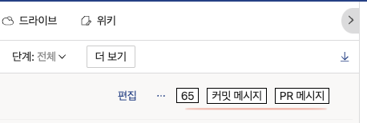

# Dooray PR Extension

Pull Request 작성규칙 통일 및 작성 번거로움을 해결하기 위해 제작된 확장도구 입니다.

## 특징

해당 프로젝트는 https://github.com/lxieyang/chrome-extension-boilerplate-react 를 기반으로 제작되었습니다.

이 프로젝트는 react, typescript를 사용하여 개발되었습니다.

boilerplate 프로젝트를 기반으로 필요한 기능을 제외한 나머지 기능은 제거되었습니다.

## 사용 방법

### 빌드 파일 생성

#### 프로젝트를 소유한 경우

1. 아래 스크립트 실행합니다.

   ```sh
   $ npm ci
   $ npm run build
   ```

2. 위 스크립트를 실행하면 루트 경로에 build 폴더가 생성됩니다.
3. build 폴더에 생성된 파일을 chrome://extensions/ 에서 업로드 합니다.

build 파일이 생성되면 루트 경로의 `/zip` 하위에 `.zip`파일이 생성됩니다.<br />
이 파일을 팀에 공유할 수 있습니다.

#### chrome://extensions 설치 파일 추가 및 테스트

1. 위에서 언급한 `.zip`파일의 다운로드 받고 적절한 위치에 압축을 해제합니다.
2. 크롬 브라우저에서 [chrome://extensions/](chrome://extensions/) 에 방문합니다.
3. 위 페이지 방문 후 "압축해제된 확장 프로그램을 로드합니다." 버튼을 클릭합니다.
   - 
4. 압축을 해제한 디렉토리를 선택하고 "선택" 버튼을 클릭합니다.
   - 
5. 아래 예시 이미지와 같이 등록된 확장도구의 확인이 가능합니다.
   - 
6. Dooray에 방문하여 추가된 버튼을 확인합니다.
   - 
7. 버튼 클릭 시 성공/실패에 따른 메시지를 노출합니다.
   - 
8. 이제 클립보드에 복사된 텍스트를 PR 제목등에 붙여 넣고 내용을 추가로 작성합니다.

## 참고 링크

- https://developer.chrome.com/docs/extensions/
- https://github.com/lxieyang/chrome-extension-boilerplate-react

## 개발 참고

이 프로젝트는 backgroundScript, contentScript에 대한 기능만 존재합니다.

ContentScript 영역의 사용자 UI를 다루기 위해서 React, Typescript가 사용되었습니다.

### ticker

1000ms 간격으로 DOM의 변화 감지를 위해 추가되었습니다.

requestAnimationFrame을 이용하여 react root 컴포넌트의 마운트 여부를 감지합니다.

SPA의 경우를 고려하여 mutation observer를 활용하여 돔 요소의 변화에 따라 클립보드 복사 대상 데이터를 갱신합니다.

탭이 활성화된 경우 클립보드 복사 버튼 UI를 mount 하고 비활성화된 경우 unmount 하도록 동작합니다.

### 디렉토리/파일

```
.src
├── assets
│   └── img
│       ├── icon-128.png
│       └── logo.svg
├── manifest.json               // manifest 설정파일
└── pages
    ├── Background              // backgroundScript
    │   └── index.js
    └── Content                 // contentScript
        ├── constants.ts        // 상수 - selector, 메시지 템플릿, tick interval 등.
        ├── content.styles.css
        ├── index.ts            // contentScript를 제어하는 루트 모듈
        ├── modules
        │   ├── clipboard.ts    // 클립보드 복사 관련 기능
        │   └── ticker.ts       // 지속적인 감지를 위한 ticker
        └── ui                  // 주입되는 화면 제어 코드(with React)
            ├── App.tsx         // 루트 컴포넌트
            └── main.tsx        // 루트 모듈
```
